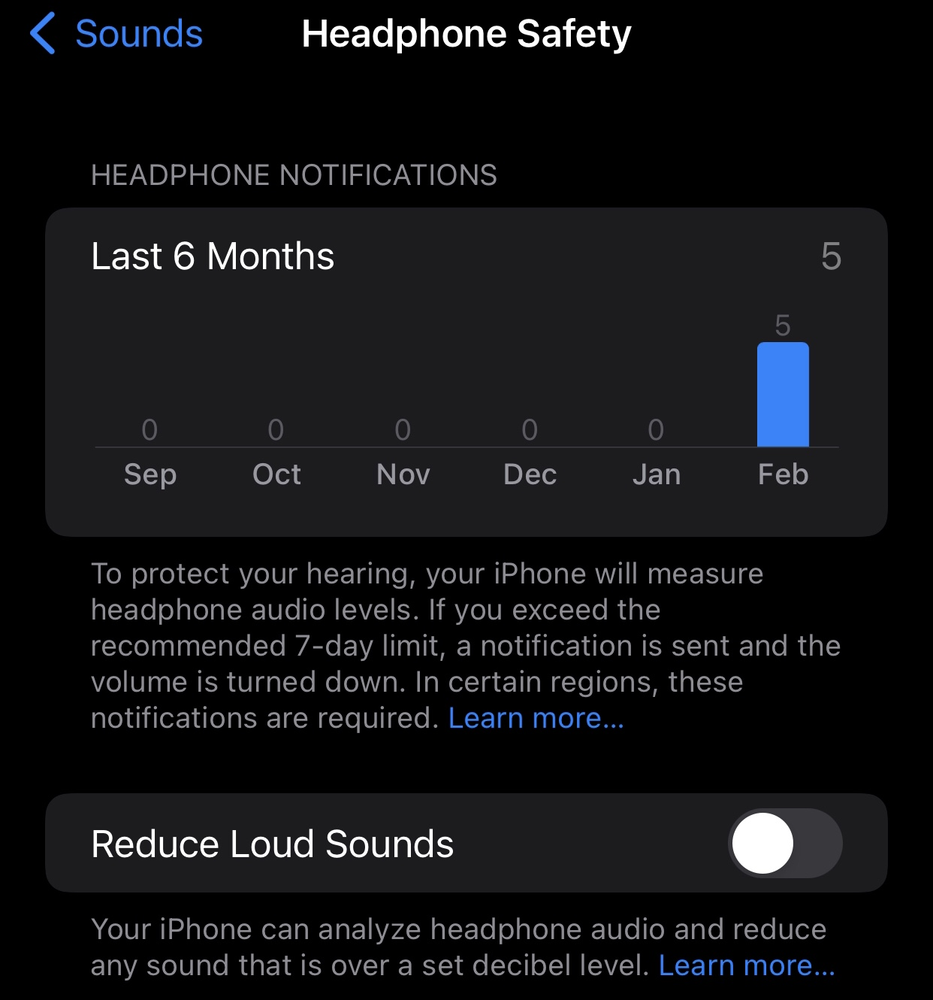
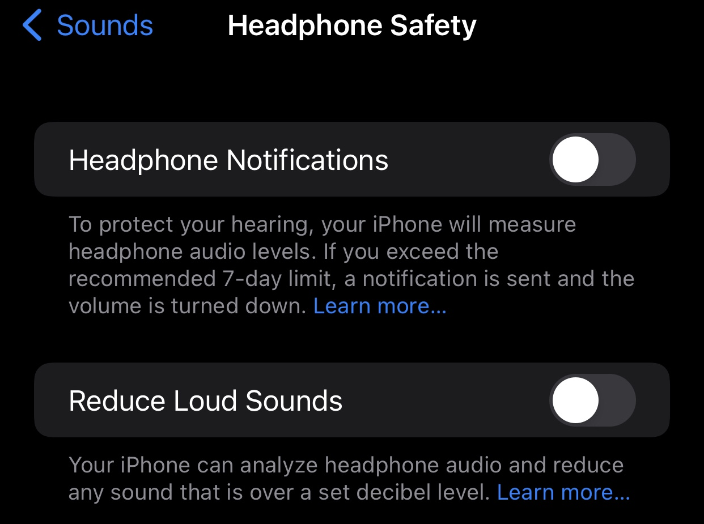

# [alex-free.github.io](https://alex-free.github.io)

# Headphone Notification Disabler

By Alex Free

Headphone Notification Disabler allows you to turn off the [loud music notification](https://support.apple.com/guide/iphone/use-headphone-audio-level-features-iph64ac7296f/ios) Apple added in iOS 14. 

This package has been tested on an iOS 15.7.6 iPhone 6S Plus jailbroken with [palera1n](https://github.com/palera1n/palera1n). It should work for any iOS version since 14. If your using Palera1n, you must specify the `-c -f` argument during the initial jailbreak (`./palera1n -c -f`), and then `-f` on each subsequent jailbreak boot (`./palera1n -f`) to use Palera1n root-full. My repo and this package does not support root-less jailbreaks.

## Links

* [Github](https://github.com/alex-free/headphone-notification-disabler)
* [Homepage](https://alex-free.github.io/headphone-notification-disabler)

## Usage

*   Add [my iOS repo](https://alex-free.github.io/ios-repo) to the package manager of your jailbroken device.

*   Search for and install `headphone notification disabler`.
*   **Reboot** your device.
*   Open the `Settings` app, and go to `Sounds`->`Headphone Safety`.
*   Turn off the `Headphone Notifications` option.

The `Headphone Notifications` option will be available in both a stock iOS and jailbroken state. You can revert this to the original behavior by uninstalling the Headphone Notification Disabler package and **rebooting** your device.

## Downloads

[headphone-notification-disabler-1.0.deb](https://github.com/alex-free/headphone-notification-disabler/releases/download/v1.0/headphone-notification-disabler-1.0.deb)